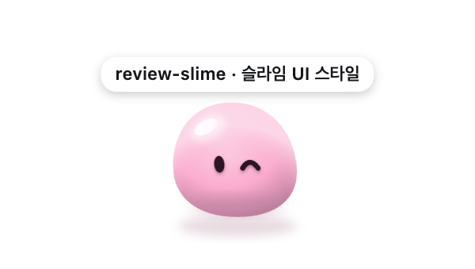
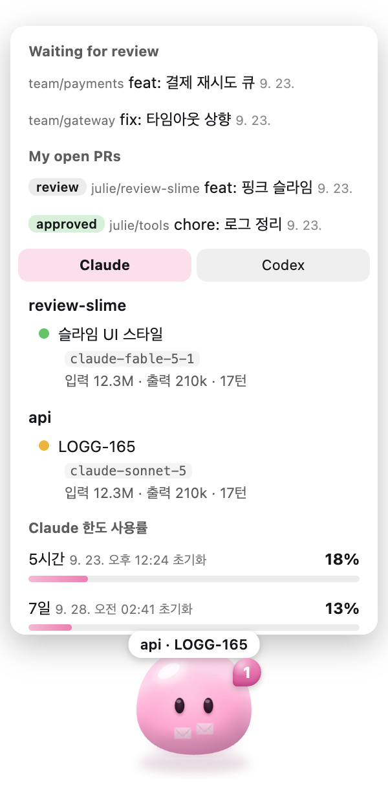

# Slimey

화면 구석에 사는 반투명 슬라임. 리뷰 요청 PR 과 Claude Code·Codex 세션 상태를 표정과 몸짓으로 알려줌.

macOS 용 Electron 앱. 런타임 의존성 없음. 데이터는 전부 로컬에서 읽음.

## 설치와 실행

```bash
npm install
npm start          # 슬라임 띄우기
npm run check      # 창 없이 세션 표와 PR 조회 결과만 터미널에 출력
```

macOS Apple Silicon 기준 (`build` 가 arm64 로 고정). Intel 이면 `package.json` 의 `--arch=x64`.

### 앱으로 설치

터미널 없이 상주시키고 싶을 때.

```sh
npm run build                                   # dist/Slimey-darwin-arm64/Slimey.app 생성
cp -r "dist/Slimey-darwin-arm64/Slimey.app" /Applications/
open "/Applications/Slimey.app"
```

- .app 으로 띄우면 로그인 시 자동 실행 켜짐. 끄려면 시스템 설정 → 로그인 항목
- 코드 수정 후엔 다시 `npm run build` → 복사
- 아이콘 모양 변경: `scripts/tray-icon.py` 수정 후 `npm run icon`
- 서명 안 한 앱이라 처음 열 때 Gatekeeper 가 막을 수 있음. 우클릭 → 열기
- `.app` 과 `npm start` 는 같은 단일 인스턴스 락을 씀. `.app` 이 떠 있으면 `npm start` 는 조용히 종료

## 설정

앱 자체 설정 파일은 없음. 이미 깔린 CLI 들의 로그인 상태와 로그를 그대로 읽는다. 필요한 것만 맞추면 됨.

| 기능 | 필요한 것 | 없으면 |
| --- | --- | --- |
| PR 알림 | `gh` CLI 설치 + `gh auth login` | PR 섹션 비어 있음. 메뉴에서 `리뷰 요청 받은 PR`/`내 PR` 끄면 gh 안 부름 |
| Claude 세션 | Claude Code 를 한 번이라도 실행 (`~/.claude/projects`, `~/.claude/sessions`) | 탭 없음 |
| Claude 한도 % | Claude Code 로그인 (Keychain `Claude Code-credentials`) | 한도 줄만 빠짐 |
| Codex 세션 | Codex CLI 실행 이력 (`~/.codex/sessions`) + `lsof` (macOS 기본) | 탭 없음. 메뉴에서 `Codex 세션` 끄면 됨 |
| Codex 한도 % | Codex 로그인 (`~/.codex/auth.json`) | 한도 줄만 빠짐 |

### 1. gh CLI

```sh
brew install gh
gh auth login          # github.com 이면 끝
```

GitHub Enterprise 면 호스트를 알려줘야 함. 둘 중 하나:

- 셸 환경변수: `GH_HOST=ghe.example.com npm start`
- `.env` 파일: `cp .env.example .env` 하고 `GH_HOST=ghe.example.com` 적기. `npm run build` 하면 `.app` 안에 같이 들어가서 앱으로 띄울 때도 적용됨

셸 환경변수가 `.env` 보다 우선. 확인은 `npm run check` (PR 목록 JSON 이 나오면 됨).

### 2. Claude Code

따로 할 것 없음. 로그인돼 있으면 됨. 처음 띄울 때 macOS 가 Keychain 접근을 물어보면 **항상 허용**. 거부하면 한도 % 만 안 나옴.

### 3. Codex

따로 할 것 없음. 안 쓰면 메뉴바 → `Codex 세션` 체크 해제.

### 4. 환경변수 정리

| 변수 | 기본값 | 용도 |
| --- | --- | --- |
| `GH_HOST` | `github.com` | gh 가 호출할 GitHub 호스트 |
| `SLIME_THROW` | 없음 | 개발용. 켜면 뜨자마자 슬라임을 한 번 던짐 |

## 모습

| 기본 | 작업 중 (배지 = 세션 수) | 내 차례 (윙크 + 말풍선) |
| :---: | :---: | :---: |
|  |  |  |

| 리뷰 요청 3개 (봉투 삼킴, 눌림) | 내 PR 에 changes requested | 내 PR 승인 |
| :---: | :---: | :---: |
|  |  |  |

| 누른 상태 | 끌리는 중 | 목록 (클릭하면 위로) |
| :---: | :---: | :---: |
|  |  |  |

이미지는 `npm run shots` 로 다시 만든다 (`scripts/shots.js`, 가짜 상태를 넣고 실제 렌더러를 캡처).

## 주요 기능

- **리뷰 요청 PR 알림**: 리뷰 요청 오면 봉투를 삼킴. 쌓일수록 커지고, 오래 방치된 PR 은 깜빡임
- **내 PR 상태 알림**: changes requested 면 슬픈 표정, 승인되면 점프하며 기뻐함
- **에이전트 세션 모니터링**: Claude Code·Codex 세션이 작업 중인지, 내 답을 기다리는지 표정으로 표시
- **내 차례 알림**: 에이전트가 답을 마치고 멈추면 윙크하며 재촉. 어느 세션인지 말풍선으로 표시
- **토큰·한도 사용량**: 오늘·이번 달 토큰 사용량과 각 서비스 한도 사용률을 목록에서 확인
- **메뉴바 아이콘**: 리뷰 대기 PR 수와 내 차례 세션 여부를 메뉴바에서도 확인. Claude·Codex 감시와 PR 종류를 메뉴에서 켜고 끔
- **만지고 던지기**: 누르고, 끌고, 던질 수 있음. 벽에 튕기며 찌부러짐

## 기능 상세

### PR 알림

| 상황 | 슬라임 반응 |
| --- | --- |
| 리뷰 요청 옴 | 봉투를 삼킴. 봉투가 몸속에 비쳐 보이고, 개수만큼 커짐 |
| 봉투 3개 이상 | 눌린 표정, 가끔 한숨 |
| 48시간 방치 | 그 봉투만 깜빡임. 목록엔 PR 마다 열린 날짜 작게 표시 |
| 내 PR 에 changes requested | 슬픈 표정 + 땀 |
| 내 PR 승인 | 웅크림 → 점프 → 정점에서 웃음 → 착지 후 하트 눈 + 하트 |

### 에이전트 세션 알림

| 상황 | 슬라임 반응 |
| --- | --- |
| 작업 중 | 위를 올려다보는 표정. 오른쪽 위 배지에 작업 중 세션 수 |
| 내 차례 (답을 마치고 멈춤) | 3~6초마다 윙크하거나 좌우로 기울이며 재촉. 머리 위 말풍선에 `repo · 세션 제목` (둘 이상이면 `외 N개`) |
| 토큰 많이 씀 | 색이 진해짐. 기준은 최근 8시간 합계 30M |

- 탭과 상관없이 전체 세션 기준으로 반응
- 배지와 말풍선은 동시에 뜰 수 있음

### 목록

슬라임 클릭하면 위로 목록이 펼쳐짐. 위에서부터:

1. **리뷰 기다리는 PR**: 내가 리뷰어로 지정된 남의 PR (draft 제외)
2. **내 PR**: 열려 있는 내 PR 전부. 태그로 review / changes / approved 표시
3. **Claude 세션 / Codex 세션** 탭
4. **사용량**: 한도 사용률(API 가 주는 %), 오늘·이번 달 토큰 사용량(로그에서 직접 센 값)

- PR 누르면 브라우저로 열림
- 비어 있는 섹션은 숨김
- 세션은 repo 헤더 아래 한 줄씩. 상태 점 · 세션 제목 · 모델 · 입력/출력 토큰 · 턴 수
- 창은 아무 데나 잡고 끌면 이동

### 세션 상태 점

목록 왼쪽의 작은 색 점.

| 점 | 상태 | 뜻 |
| --- | --- | --- |
| 초록 | working | 에이전트 작업 중. 기다리면 됨 |
| 노랑 | waiting | 에이전트가 말을 마치고 멈춤. **내 차례**. 가서 답하거나 확인 |
| 회색 | idle | 열려 있지만 한참 조용함 (Codex 만) |
| 없음 | 닫힘 | 목록에서 사라짐 |

### 메뉴바 아이콘

- 슬라임 아이콘 옆에 리뷰 대기 PR 수
- 내 차례 세션 있으면 아이콘에 말풍선
- 메뉴에서 켜고 끄기 (체크박스, 재시작해도 유지)
  - `Claude 세션` / `Codex 세션`: 끄면 목록 탭·표정·한도 조회에서 빠짐
  - `리뷰 요청 받은 PR` / `내 PR`: 끄면 목록·봉투·표정에서 빠짐. 둘 다 끄면 gh 도 안 부름 (혼자 개발하면 리뷰 요청은 끄고 내 PR 만 보거나, 둘 다 끄고 세션만)
- `Slimey 종료`

### 만지기

- **클릭**: 누르면 두 단계로 납작, 놓으면 튀어 올랐다가 제자리
- **드래그**: 들리면서 위로 늘어나고, 끄는 방향 반대쪽으로 처짐. 내려놓으면 착지 → 튕김. 창도 같이 이동
- **던지기**: 빠르게 놓으면 날아감
  - 출발 속도: 놓는 순간 손 속도의 50% (최대 1400px/s)
  - 중력 1800px/s² 로 포물선
  - 벽·천장·바닥에 닿으면 입사각 = 반사각으로 튕김. 속도는 80% 유지
  - 닿을 때마다 찌부 + 방울 튐. 벽에 수직인 충돌 속도가 클수록 더 납작하게(최대 Q3 수준), 더 오래, 방울도 더 많이·멀리
  - 공기 마찰로 초당 15% 감속. 바닥에 붙으면 굴러서 멈춘 뒤 표정 복귀
  - 날아가는 중에 잡으면 그 자리에서 멈춤

### 표정 우선순위

슬픔(수정 요청) > 내 차례 > 올려봄(작업 중) > 눌림(봉투 3개 이상) > 기본

- 한가할 때: 4~12초마다 랜덤 잔동작 (깜빡임, 웃음, 하트 눈, 졸림, 윙크, 짜증, 올려봄, 기울임, 깡총)
- 내 차례일 때: 좌우 기울임으로 재촉
- 슬플 때: 가만히 있음

## 동작 방식

### 데이터 읽기

- **PR**: 60초마다 `gh api search/issues` 4회 호출. 조건은 `review-requested:@me` / `author:@me review:changes_requested` / `review:approved` / `author:@me`
- **Claude Code**: `~/.claude/projects/*/*.jsonl` 꼬리만 이어 읽음. assistant 줄의 `message.usage` 로 토큰 누적, 마지막 줄이 도구 호출인지 답변인지로 상태 판정
- **Codex**: `~/.codex/sessions/**/rollout-*.jsonl`. `task_started` / `task_complete` 로 상태, `token_count.info.total_token_usage` 로 토큰. 3초마다

### 상태 판정 (`src/agents.js`)

- 8초 안에 로그 늘면 **working**
- 도구 결과 대기 중이면 10분까지 **working**
- 말을 마친 뒤 30분 안이면 **waiting**
- 그 외 **idle**

에이전트별 규칙:

- **Claude**: `~/.claude/sessions/<pid>.json` 레지스트리에 있는(살아 있는) 세션만 표시. status 가 `busy` 면 working, `idle` 이면 waiting. 살아 있으면 둘 중 하나라 idle(회색) 없음. 레지스트리에 없거나 pid 죽으면 닫힘
- **Codex**: 8초 안에 로그가 늘었거나 task 결과 대기 중(최대 10분)이면 working. `task_complete` 후 30분까지 waiting, 이후 idle. `lsof` 로 codex 프로세스 cwd 확인, 프로세스 없는 repo 는 숨김

기타:

- 8시간 조용한 세션은 목록에서 제외. 단, 이번 달에 건드린 파일은 전부 읽어 오늘·이번 달 토큰 합계에 포함
- 턴 수: 사용자 메시지 수 (중간에 끼워 넣은 것 포함)
- 세션 제목: Claude Code 가 로그에 남기는 `ai-title` (`--resume` 목록의 그것). 없으면 최근 사용자 메시지의 첫 구절

### 한도 사용률 (`src/usage.js`)

각 CLI 의 로그인 토큰을 그대로 써서 5분마다 서비스 API 호출.

- **Claude**: Keychain `Claude Code-credentials` → `api.anthropic.com/api/oauth/usage`. 5시간·7일 %
- **Codex**: `~/.codex/auth.json` → `chatgpt.com/backend-api/wham/usage`. rate_limit 창 기준, business 플랜은 spend_control 크레딧 %

자주 호출하면 429 발생. 개발 중 `npm run check` 나 앱 재시작을 반복하면 금방 막힘.

- 실패 시 마지막 값 유지
- 다음 시도 간격은 두 배씩 늘림 (최대 20분)
- 15분 넘게 못 가져오면 목록에 기준 시각 표시

### 그리기 (`src/renderer/`)

- 슬라임은 SVG 하나를 인라인으로 두고, 몸통 scale/skew/translate·그림자·눈 위치와 모양을 CSS 변수로 움직임. 포즈 표(`POSE`)의 값을 바꾸면 CSS transition 이 중간 프레임을 만듦
- 몸통·그림자 transform 은 `<svg>` 요소 자체에 걸어 합성 레이어로 처리. 블러 필터를 매 프레임 다시 그리지 않음
- 무한 CSS 애니메이션 없음. 그림은 포즈가 바뀌는 0.2초 동안만 다시 그려짐

## 리소스 사용량

- 메모리: 약 170~220MB
- CPU: 대기 1% 안팎, 잔동작 중 5% 안팎
- 창 크기: 슬라임 300×170 고정. 목록은 300×470 자식 창으로 머리 위에 뜬다 (창을 리사이즈하면 이전 그림이 한 프레임 튀어 보여서)
- 하드웨어 가속 꺼져 있음 (소프트웨어 합성으로 그림). GPU 프로세스 183MB → 44MB
